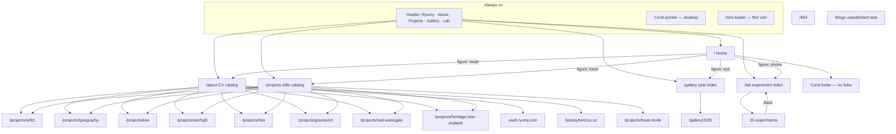
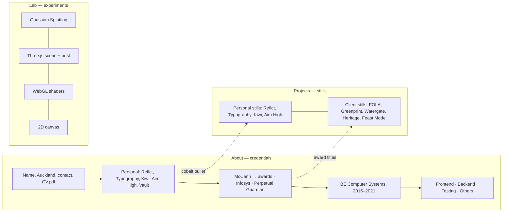
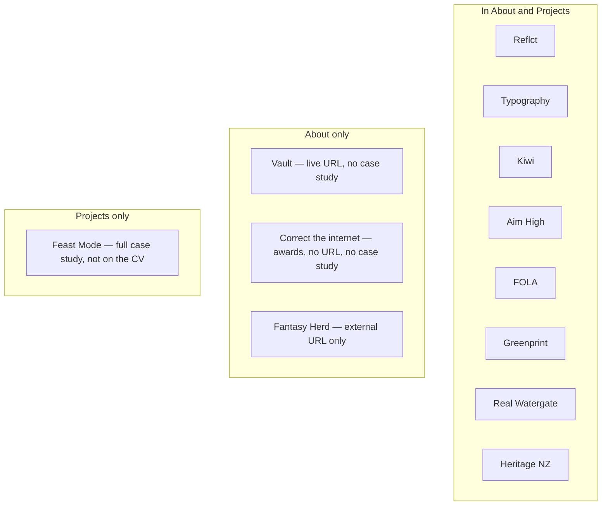
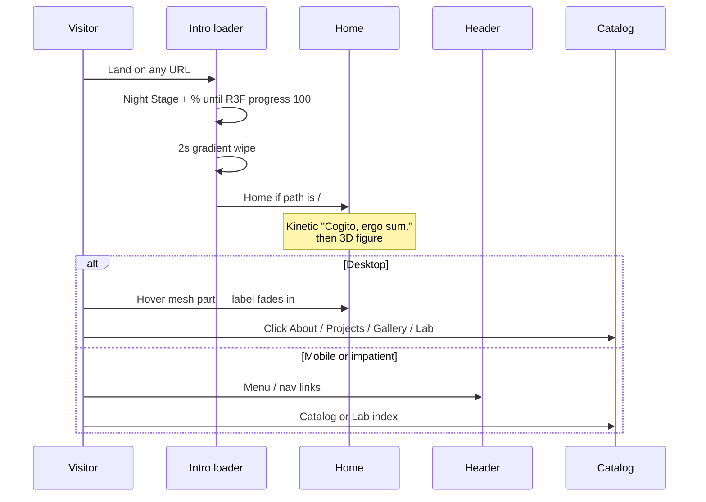
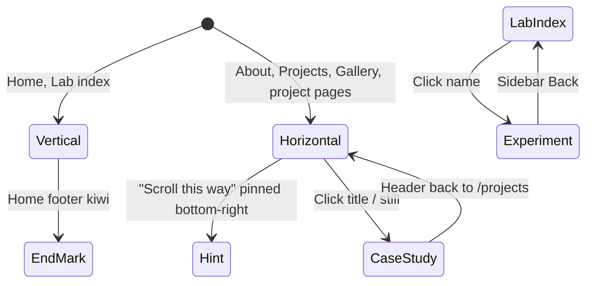
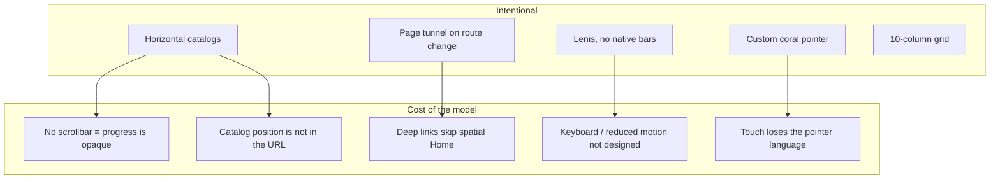
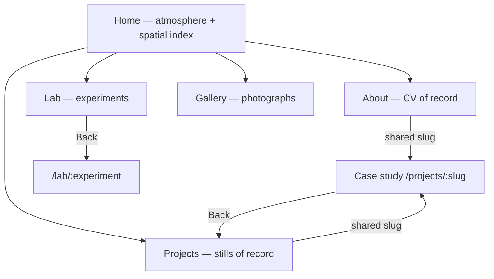

# Content structure and UX review

Review of [ryumy.com](https://www.ryumy.com/) as implemented in this repo. Scope is information architecture, content inventory, and interaction — not visual-token compliance (see `DESIGN.md`).

**Dials the site already commits to:** Creativity 9, Density 4, Variance 8, Motion Intent 8. Findings below treat those as constraints, not bugs. Horizontal catalogs, hidden home labels, and a coral pointer are intentional. The issues are where that model leaks, duplicates, or dead-ends.

---

## 1. What the site is for

A visitor should leave with three things: who In Ha Ryu is, what the work looks like, and that the practice is WebGL / 3D / editorial frontend.

Those jobs are split across four public surfaces:

| Job | Surface | Format |
| --- | --- | --- |
| Identity and credentials | `/about` | Horizontal CV catalog |
| Work, seen | `/projects` | Horizontal stills catalog |
| Practice, played | `/lab` | Vertical index → full-bleed experiment |
| Photography | `/gallery` | Year index → horizontal stills |
| Wayfinding / atmosphere | `/` | Vertical: kinetic type, then a 3D figure |

Header (About / Projects / Gallery / Lab) is the reliable path. Home is a spatial index, not a content page.

---

## 2. Site map

`/blogs` is routed but not in the header, home figure, or About. It is a horizontal strip of red placeholders. Treat it as dead inventory until it has content or is removed.

---

## 3. Content architecture

Two catalogs describe the same person with different jobs. About is the CV. Projects is the lookbook. Lab is not a third portfolio — it is a sketchbook.

### Overlap (the actual content bug)

Work that exists in one catalog but not the other:

That split is the main structural problem. A recruiter on About never sees Feast Mode. A visitor on Projects never sees Vault, Correct the internet, or the award weight of Fantasy Herd. The two surfaces do not share a source of truth; each page hard-codes its own list.

---

## 4. Session flows

### First visit

The loader is global (`components/loader.tsx` + `stores/intro.ts`). It keys off `@react-three/drei` `useProgress`, so the first paint of the whole site waits on 3D assets even if the visitor deep-linked to `/about`. There is no `prefers-reduced-motion` branch.

### Catalog reading

Once inside a project page there is no next/previous, no “more projects”, and no crumb. The only exit is the header. Lab experiments are better: sidebar **Back** returns to `/lab`.

---

## 5. Surface-by-surface UX

### Home `/`

Vertical Lenis. Hero is full `svh` kinetic type over Rodin. The figure is the sitemap: head → About, hand → Projects, eye → Gallery, phone → Lab.

**Works:** Matches the design brief (spatial punctuation, not a centered hero). Header duplicates the four destinations, so the figure can stay cryptic.

**Friction:** On desktop the labels are `opacity-0` until hover. The hit targets are vw-sized boxes on mesh parts — poetic, easy to miss. Mobile shows labels always, which is the correct fallback. The coral footer is brand, not navigation: it eases to 10% coral and rolls a kiwi. No contact, no CV, no secondary links.

### About `/about`

Horizontal CV. Intro column (name, maxim, Auckland, GitHub, LinkedIn, phone, email, CV.pdf) then section rules: Personal | Experience | Education | Skills.

**Works:** Dates in Coral Signal. Personal titles with cobalt 8px bullets go to case studies. Awards that have pages are cobalt-underlined. Skills are body copy under Playfair headings, not fake bullets.

**Friction:**

- The strip is long. There is no in-page jump to Experience / Skills. “Scroll this way” is the only progress cue; native scrollbars are hidden behind Lenis + `overflow-hidden`.
- Vault is a live product with no case study and no cobalt bullet.
- Correct the internet is the most awarded line on the CV and is not a link.
- Email is rendered as `INHA.RYU.97@GMAIL.COM`.
- Award footnotes (`*Cannes Lions 2024` …) are CV-faithful but sit in a ~30vw column after a dense nested list.

### Projects `/projects` and case studies

Same horizontal machine as About, with clip-reveal stills and Playfair titles on `bg-white/80`.

Order today: Reflct → Typography → Kiwi → Aim High → FOLA → Greenprint → Real Watergate → Heritage NZ → Feast Mode. That is neither chronological nor “personal then client” in a labelled way. A visitor cannot tell agency work from personal work until they open a page (`- Personal · 2024` vs `- DDB NZ`).

Case studies are a repeating pattern: title + live URL → text / stills → Links column. Strength varies. Reflct and Feast Mode are rich. Aim High and Heritage are thin (few stills, short copy). There is no role line (“Senior frontend, McCann”) on client pages except the DDB kicker.

### Gallery `/gallery`

One year (`2025`) then a Vault-backed stills strip. As a primary nav item equal to Projects and Lab, it is thin. Fine as a side room; odd as 25% of the header.

### Lab `/lab` and experiments

Best internal IA on the site. Categories (coral Playfair) → optional subheads (Steel Caption) → experiment names (Ink Playfair). Vertical scroll. Experiments use a 10-column shell: sidebar cols 1–3 (Back, title, description, controls), canvas the rest. Mobile sidebar is an overlay; a coral control toggles it.

**Friction:** Header uses the word “Menu”; lab chrome uses a hamburger icon. DESIGN.md asked for word Menu on the site chrome and 44px taps — the icon control is smaller and less consistent. `LabLink` draws a CSS underline on hover (`h-0.5 w-0 group-hover:w-full`) while the rest of desktop uses the coral pointer instead of CSS underlines.

### 404

30vw coral Playfair over a 3D field. The type wrapper is `pointer-events-none`. There is no “Home” or “Lab” recovery. Beautiful, incomplete.

---

## 6. Cross-cutting UX

- **Orientation** is taught once (“Scroll this way”) and then assumed. Fine for a short Projects strip; weak for About.
- **Wayfinding after a case study** depends entirely on the header. Lab solved this with Back; projects did not.
- **Motion** is the personality. Without a reduced-motion path, the intro wipe, marquee, and tunnel are unavoidable.
- **Touch:** catalogs stay horizontal (correct per DESIGN.md). The coral pointer hides. Mobile underlines on `a` pick up the slack. Home labels stay visible. This is the one place the site already designs the fallback.
- **Unpublished `/blogs`** will 200 if guessed or crawled. It does not match the design system (raw red blocks).

---

## 7. Findings, ordered

**P1 — Catalogs disagree.** About and Projects should be two views of one list. Today Feast Mode, Vault, Correct the internet, and Fantasy Herd fall through the cracks. Pick a rule (e.g. “if it has stills it is in Projects; if it is on the CV it is in About; work with stills must appear in both”) and enforce it.

**P2 — About has no internal navigation.** Personal → Experience → Education → Skills is a single unnamed axis. A short coral jump list (or section markers that the pointer can hit) would keep density 4 without making Skills a secret.

**P3 — Home desktop labels are hover-only.** Keep the mystery, but give a persistent cue (one visible label, or a faint “hover the figure”) so the spatial map is learnable. Header already saves the task; the figure should teach, not hide.

**P4 — Case studies are dead ends.** Add Back to `/projects` (mirror Lab) and optional prev/next. Header-only exit feels like leaving the building.

**P5 — 404 and `/blogs`.** 404 needs a recovery link. `/blogs` should 404 or stay unrouted until it is a real surface.

**P6 — Secondary, still worth doing.**

- Show role / year / personal-vs-client on the Projects strip, not only inside the case study.
- Link or explicitly mark Correct the internet; decide Vault’s case-study status.
- Sentence-case the email.
- Align lab Menu with header copy; drop the CSS underline on lab names in favour of the pointer.
- `prefers-reduced-motion`: skip loader wipe and marquee, or shorten them.
- Gallery as a header peer is disproportionate until there is more than one year.

---

## 8. Recommended IA (not a redesign)

Keep four header destinations. Make the content graph explicit:

Rule of thumb: **About narrates, Projects shows, Lab plays, Gallery is extra.** Anything with a case study slug belongs in both About and Projects. Anything CV-only (employment, education, skills, awards without stills) stays on About. Experiments never appear in Projects unless they graduate.

---

## 9. Source map

| Behaviour | Where |
| --- | --- |
| Routes | `app/**/page.tsx` |
| Header / mobile menu | `components/header.tsx` |
| Home figure hotspots | `app/home/main.tsx` |
| About CV | `app/about/page.tsx` |
| Projects index | `app/projects/page.tsx` |
| Lab index | `lib/lab/labs.ts`, `app/lab/page.tsx` |
| Lab chrome | `app/lab/lab-page-layout.tsx` |
| Intro | `components/loader.tsx`, `stores/intro.ts` |
| Scroll | `components/smooth-scroll.tsx` |
| Pointer | `components/pointer.tsx` |
| Design intent | `DESIGN.md` |
